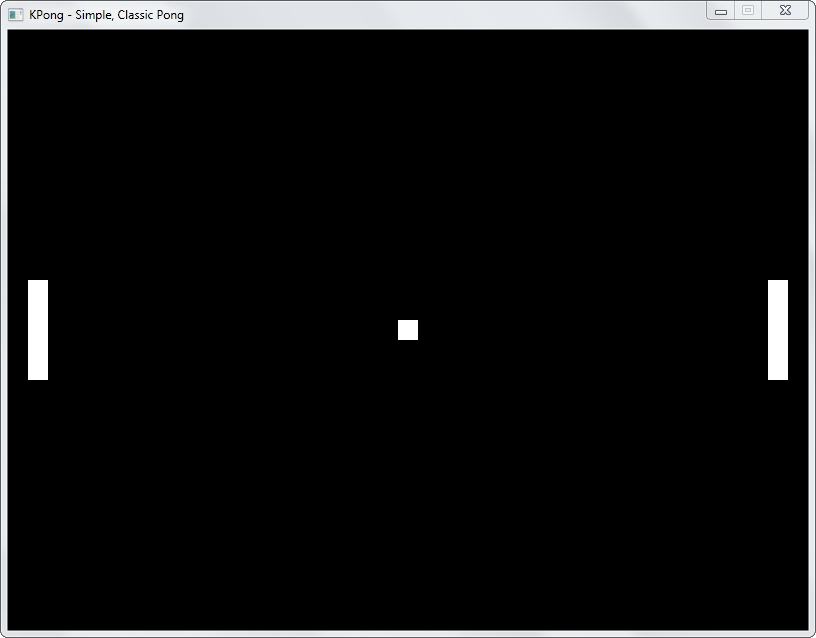

# KPong

Simple, Classic, Pong!

Pong clone written in C++ and SDL. Currently a work in progress. Watch this space for updates

==================================================================================================

Version History -

0.3
- Collision detection added
- Better keyboard scancode handling

v0.2 
- Paddle and Ball movement added. 
- Sucky performance and flickering. Ugh!

v0.1 
- Added basic GWO subsystem and rendering. 
- Bug fixes.
- Performance still terrible. Lots to do. 

Initial commit 
- KPong born!
